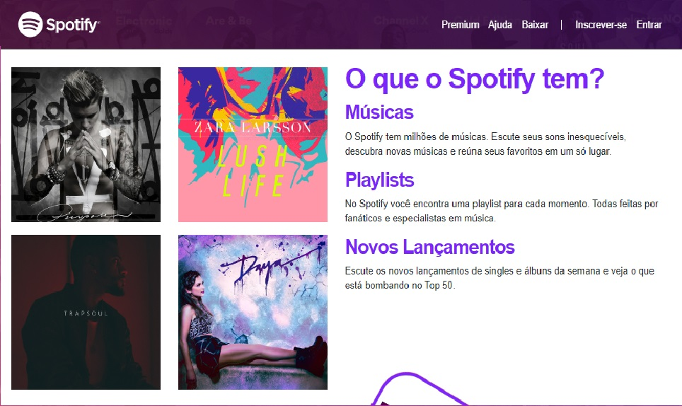

# Spotify Clone

Welcome! 

This repository contains a RESPONSIVE Spotify clone home page created for educational purposes to fix HTML, CSS and Bootstrap learning.

This project was developed during the [Complete Web Development](https://www.udemy.com/course/web-completo/) course (Section Bootstrap4 and Responsive Design) held at UDEMY.

* Home Page Header


* Home Page Main



* Home Page Footer


# 🧠 About

The goal with this project is learn and practice about this functionalities below:

- [x] Responsive design
- [x] Bootstrap
- [x] Navbar with transparency
- [x] Slider
- [x] Parallax
- [x] Floating elements
- [x] Margin
- [x] Padding
- [x] Media Queries
- [x] Buttons
- [x] Cards
- [x] Align items
- [x] Icons
- [x] Grid
- [x] Flexbox
- [x] Menu Hamburger

## 🖥️ Installation

1. Clone this repo
```bash
git clone https://github.com/robernar2011/SpotifyClone.git
```
